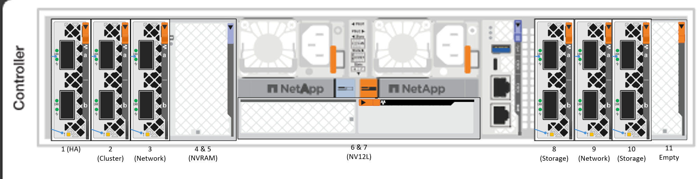
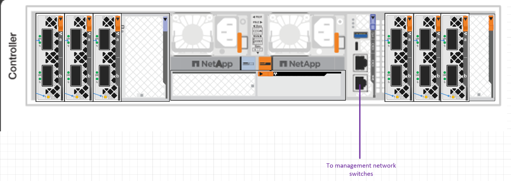
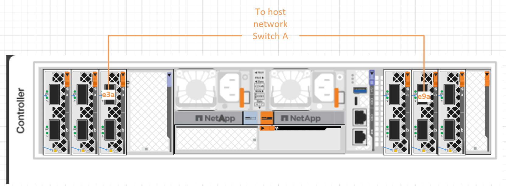
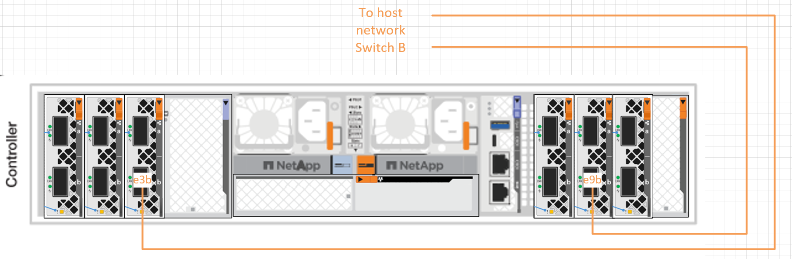
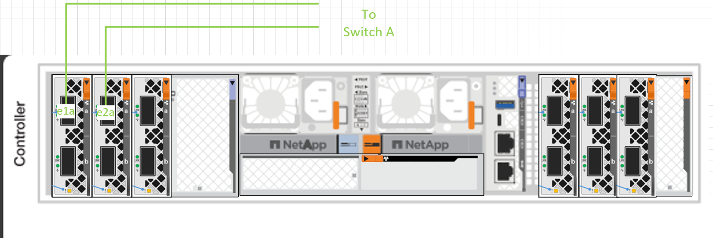
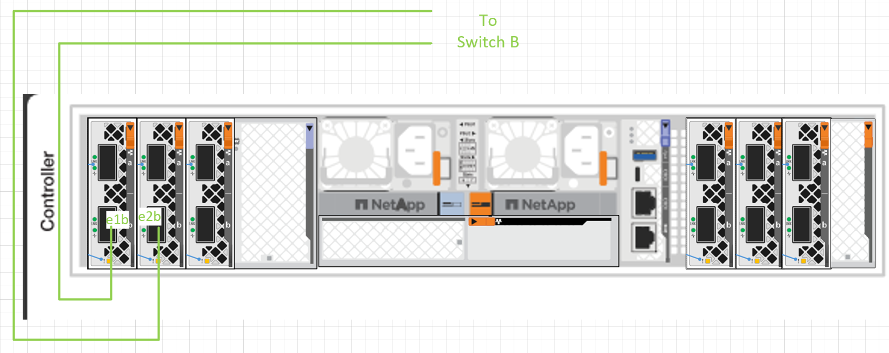
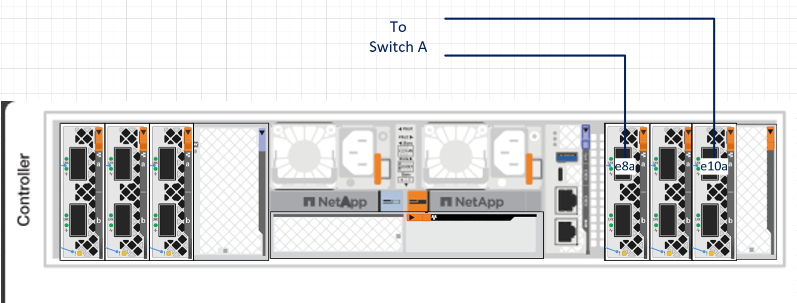
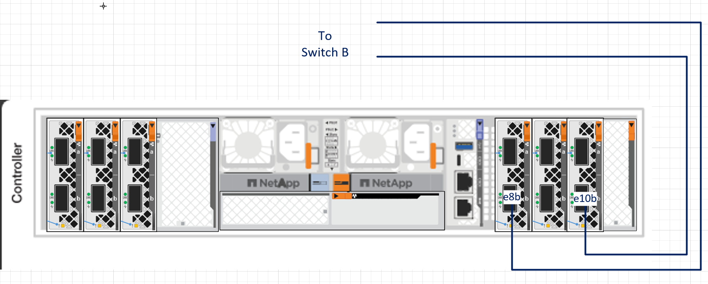

= Cable the hardware for your AFX 2K storage system
:icons: font
:imagesdir: ../media/

[.lead]
After you install the rack hardware for your AFX 2K storage system, install the network cables for the controllers, and connect the cables between the controllers and storage shelves.

.Before you begin

Contact your network administrator for information about connecting the storage system to your network switches.

.About this task
* These procedures show common configurations. The specific cabling depends on the components ordered for your storage system. For comprehensive configuration details and slot priorities, see link:https://hwu.netapp.com[NetApp Hardware Universe^].
* The I/O slots on an AFX 2K controller are numbered 1 through 11.
+

* The cabling graphics show arrow icons indicating the proper orientation (up or down) of the cable connector pull-tab when inserting a connector into a port.
+
As you insert the connector, you should feel it click into place; if you do not feel it click, remove it, turn it over and try again.
+
image:../media/drw_cable_pull_tab_direction_ieops-1699.svg[Cable pull tab direction]
+
[NOTE]
====
The connector components are delicate and care should be taken when clicking into place.
====

* When cabling to an optical fiber connection, insert the optical transceiver into the controller port before cabling to the switch port.

* The AFX 2K storage system utilizes 400GbE cables. The 400GbE connections are made between the controllers and the switches. Connections between the storage shelves and the switches utilize 4x100GbE breakout cables with the 100GbE connections  made to the drive shelf ports. 
+
Storage and HA/Cluster connections can be made to any non-ISL port on the switch. All "a" controller ports connect to switch A, and all "b" controller ports connect to switch B.
+
** 1 x HA port (slot 1)
** 1 x cluster port (slot 2)
** 2 x storage ports (slots 8, 10) 

NOTE: Cisco Nexus 9808 NX-OS, 9332D-GX2B and 9364D-GX2A switch configurations to the AFX 2K storage system require 400GbE breakout cable connections.

== Step 1: Connect the controllers to the management network
Connect the management (wrench) port on each controlller to either of the management switches or connect them directly to your management network.

Use the 1000BASE-T RJ-45 cables to connect the management (wrench) ports on each controller to the management network switches.

*1000BASE-T RJ-45 cables*

IMPORTANT: Do not plug in the power cords yet. 

. Connect to host network. 

== Step 2: Connect the controllers to the host network
Connect the Ethernet module ports to your host network. 

This procedure may differ depending on your I/O module configuration. The following are some typical host network cabling examples. See  link:https://hwu.netapp.com[NetApp Hardware Universe^] for your specific system configuration.

.Steps

. Connect the following ports to your Ethernet data network switch A.
* Controller (Example)
** e3a
** e9a
+
*400GbE cables*
+
image::../media/oie_cable100_gbe_qsfp28.png[100 Gb Ethernet cable]
+

. Connect the following ports to your Ethernet data network switch B.
* Controller (Example)
** e3b
** e9b
+
*400GbE cables*
+
image::../media/oie_cable100_gbe_qsfp28.png[100 Gb Ethernet cable]
+

== Step 3: Cable the cluster and HA connections
Use the Cluster and HA interconnect cable to connect ports e1a and e2a to switch A and e1b and e2b to switch B. The e1a/e1b ports are used for the HA connections, and the e2a/e2a ports are used for the cluster connections.

.Steps

. Connect the following controller ports to any non-ISL port on the cluster network switch A.
* Controller
** e1a
** e2a
+
*400GbE cables*
+
image::../media/oie_cable_25Gb_Ethernet_SFP28_ieops-1069.png[Cluster HA cable]
+

. Connect the following controller ports to any non-ISL port on the cluster network switch B.
* Controller
** e1a
** e2b
+
*400GbE cables*
+
image::../media/oie_cable_25Gb_Ethernet_SFP28_ieops-1069.png[Cluster HA cable]
+

== Step 4: Cable the controller-to-switch storage connections
Connect the controller storage ports to the switches.  Ensure you have the correct cables and connectors for your switches. See https://hwu.netapp.com[Hardware Universe^] for more information.

. Connect the following storage ports to any non-ISL port on switch A.
* Controller
** e8a
** e10a
+
*400GbE cables*
+
image::../media/oie_cable100_gbe_qsfp28.png[100 Gb cable]
+

. Connect the following storage ports to any non-ISL port on switch B.
* Controller
** e8b
** e10b
+
*400GbE cables*
+
image::../media/oie_cable100_gbe_qsfp28.png[100 Gb cable]
+

== Step 5: Cable the shelf-to-switch connections
Connect the NX224 storage shelves to the switches.   

For the maximum number of shelves supported for your storage system and for all of your cabling options, see link:https://hwu.netapp.com[NetApp Hardware Universe^].

. Connect the following shelf ports to any non-ISL port on switch A and switch B for module A.
* Module A to switch A connections
** e1a
** e2a
** e3a
** e4a
* Module A to switch B connections
** e1b
** e2b
** e3b
** e4b
+
*100GbE cables*
+
image::../media/oie_cable100_gbe_qsfp28.png[100 Gb cable]
+
image::../media/drw_afx_shelf_cabling_a_ieops-2356.svg[Cable shelf to switch A and switch B]

. Connect the following shelf ports to any non-ISL port on switch A and switch B for module B.
* Module B to switch A connections
** e1a
** e2a
** e3a
** e4a
* Module B to switch B connections
** e1b
** e2b
** e3b
** e4b
+ 
*100GbE cables*
+
image::../media/oie_cable100_gbe_qsfp28.png[100 Gb cable]
+
image::../media/drw_afx_shelf_cabling_b_ieops-2357.svg[Cable shelf to switch A and switch B]

.What's next?

After cabling the hardware, link:power-on-configure-switch.html[power on and configure the switches].
