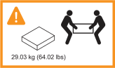
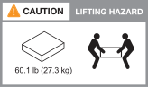
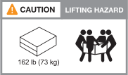
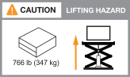

= Installation requirements for AFX 2K storage systems
:icons: font
:imagesdir: ../media/

[.lead]
Review the equipment needed and the lifting precautions for your AFX 2K storage controller and storage shelves. 

== Equipment needed for install
To install your AFX 2K storage system, you need the following equipment and tools. 

** Access to a Web browser to configure your storage system
** Electrostatic discharge (ESD) strap 
** Flashlight
** Laptop or console with a USB/serial connection
** Paperclip or narrow-tipped ballpoint pen for setting storage shelf IDs
** Phillips #2 screwdriver 

== Lifting precautions 
AFX storage controller and storage shelves are heavy. Exercise caution when lifting and moving these items.

=== Storage controller weights
Take the necessary precautions when moving or lifting your AFX 2K storage controller.

An AFX 2K storage controller can weigh up to 64.0 lb (29.03 kg). To lift the storage controller, use two people or a hydraulic lift.

.AFX 2K controller lifting precaution.

=== Storage shelf weights
Take the necessary precautions when moving or lifting your shelf.

.NX224 shelf

An NX224 shelf can weigh up to 60.1 lb (27.3 kg). To lift the shelf, use two people or a hydraulic lift. Keep all components in the shelf (both front and rear) to prevent unbalancing the shelf weight.

.NX224 shelf lifting precaution.

=== Switch weights
Take the necessary precautions when moving or lifting your switch.

.Cisco Nexus 9808  

An unloaded Cisco 9808 can weigh up to link:https://www.cisco.com/c/en/us/products/collateral/switches/nexus-9000-series-switches/nexus9800-series-switches-ds.html#Productspecifications[162 lb (73 kg) and a fully loaded Cisco 9808 switch can up to 766 lb (347 kg) ^]. To lift the switch, use a hydraulic lift. 

.Unloaded Cisco Nexus 9808 lifting precaution.

.Fully loaded Cisco Nexus 9808 lifting precaution.

.Cisco Nexus9332D-GX2B 

A Cisco 9332D-GX2B can weigh up to link:https://www.cisco.com/c/en/us/td/docs/dcn/hw/aci/nexus9000/9332d-gx2b/cisco-nexus-9332d-gx2b-aci-mode-switch-hardware-installation-guide/m_n93xxx_system_specs.html[12.7 kg (28.1 lb)^].

.Cisco Nexus 9364D-GX2A

A Cisco Nexus 9364D-GX2A switch can weigh up to link:https://www.cisco.com/c/en/us/td/docs/dcn/hw/nx-os/nexus9000/9364d-gx2a/cisco-nexus-9364d-gx2a-nx-os-mode-switch-hardware-installation-guide/m_n93xxx_system_specs.html[58 lb (26.3 kg)^]. To lift the switch, use two people or a hydraulic lift.

.Cisco Nexus 9364D-GX2A lifting precaution.
image::../media/drw_afx_2k_9364d_weight_caution_ieops-2942.svg[Cisco Nexus 9364D-GX2A lifting caution icon]

.Related information

*  https://library.netapp.com/ecm/ecm_download_file/ECMP12475945[Safety information and regulatory notices^]

.What's next?
After you've reviewed the hardware requirements, you link:prepare-hardware.html[prepare to install your AFX 2K storage system].

// 2024 Sept 23, ONTAPDOC 1922
