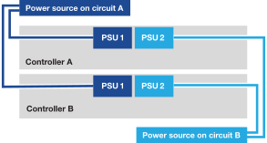

= Power on your AFX 2K storage system
:icons: font
:imagesdir: ../media/

[.lead]
After you install the rack hardware for your AFX 2K storage system and install the cables for the controller nodes and storage shelves, you should power on your storage shelves and controller nodes.

== Step 1: Power on the shelf and assign shelf ID
Each shelf has a unique shelf ID, ensuring its distinction in your storage system setup.

.About this task
* A valid shelf ID is 01 through 99. 

* You must power cycle a shelf (unplug both power cords, wait a minimum of 10 seconds, and then plug them back in) for the shelf ID to take effect.

.Steps
. Power on the shelf by connecting the power cords first to the shelf, securing them in place with the power cord retainer, and then connecting the power cords to power sources on different circuits.
+
The shelf automatically powers on and boots when plugged in. 

. Remove the left end cap to access the shelf ID button behind the faceplate.
+
image::../media/drw_tp_change_shelf_id_ieops-2381.svg[Change NX224 shelf ID]
+

[cols="20%,80%"]
|===
a|
image::../media/icon_round_1.png[Callout number 1] 
a|
Shelf end cap
a|
image::../media/icon_round_2.png[[Callout number 2]
a|
Shelf faceplate 
a|
image::../media/icon_round_3.png[[Callout number 3]
a|
Shelf ID number
a|
image::../media/icon_round_4.png[[Callout number 4]
a|
Shelf ID button

|===
+
. Change the first number of the shelf ID:
.. Insert the straightened end of a paperclip or narrow tipped ball point pen into the small hole to gently press the shelf ID button.
+

.. Gently press and hold the shelf ID button until the first number on the digital display blinks, and then release the button.
+
The number blinks within 15 seconds, activating shelf ID programming mode.
+
NOTE: If the ID takes longer than 15 seconds to blink, press and hold the shelf ID button again, making sure to press it in all the way.

.. Press and release the shelf ID button to advance the number until you reach the desired number from 0 to 9.
+
Each press and release duration can be as short as one second.
+
The first number continues to blink.
. Change the second number of the shelf ID:
.. Press and hold the button until the second number on the digital display blinks.
+
It can take up to three seconds for the number to blink.
+
The first number on the digital display stops blinking.

.. Press and release the shelf ID button to advance the number until you reach the desired number from 0 to 9.
+
The second number continues to blink.
. Lock in the desired number and exit the programming mode by pressing and holding the shelf ID button until the second number stops blinking.
+
It can take up to three seconds for the number to stop blinking.
+
Both numbers on the digital display start blinking and the amber LED illuminates after about five seconds, alerting you that the pending shelf ID has not yet taken effect.

. Power-cycle the shelf for at least 10 seconds to make the shelf ID take effect.
+
.. Unplug the power cord from both power supplies on the shelf.
+
.. Wait 10 seconds.
+
.. Plug the power cords back into the shelf power supplies to complete the power cycle.
+
The power supply powers on as soon as you plug in the power cord. Its bicolored LED should illuminate green.

. Replace the left end cap.

== Step 2: Power on the controller nodes
After you've turned on your storage shelves and assigned them unique IDs, turn on the power to the storage controller nodes.

.Steps

. Connect your laptop to the serial console port. This allows you to monitor the boot sequence when the controllers are powered on.

.. Set the serial console port on the laptop to 115,200 baud with N-8-1.
+
See your laptop's online help for instructions on how to configure the serial console port.

..  Connect the console cable to the laptop, and connect the serial console port on the controller using the console cable that came with your storage system.
 
.. Connect the laptop to the switch on the management subnet.
+
image::../media/drw_afx_1k_console_connection_ieops-2708.svg[Console connections]

[start=2]

. Assign a TCP/IP address to the laptop, using one that is on the management subnet.
+
. Plug the power cords into the controller power supplies, and then connect them to power sources on different circuits.
+

+
* The system begins to boot. Initial booting may take up to eight minutes. 
+
* The LEDs flash on and the fans start, indicating that the controllers are powering on.
+
* The fans may be noisy at start-up, which is normal.

[start=4]
. Secure the power cords using the securing device on each power supply.

== Step 3: Verify the switch connections

From the switch CLI, verify that the switch ports connected to the cluster ports are up, that the cluster nodes are in their correct cluster VLANs, and that the ISL connection between the two switches is functional.

. Verify that the switch ports connected to the cluster ports are up:
+
`show interface brief`
+
You can use `| grep up` to filter the output to only show the ports that are up.
+
.Show example for Cisco Nexus 9332D-GX2B and 9364D-GX2A switches
[%collapsible]
====

[subs=+quotes]
----
cs1# *show interface brief | grep up*
.
.
Eth1/9/3        1       eth  trunk  up      none                     100G(D) --
Eth1/9/4        1       eth  trunk  up      none                     100G(D) --
Eth1/15/1       1       eth  trunk  up      none                     100G(D) --
Eth1/15/2       1       eth  trunk  up      none                     100G(D) --
Eth1/15/3       1       eth  trunk  up      none                     100G(D) --
Eth1/15/4       1       eth  trunk  up      none                     100G(D) --
Eth1/16/1       1       eth  trunk  up      none                     100G(D) --
Eth1/16/2       1       eth  trunk  up      none                     100G(D) --
Eth1/16/3       1       eth  trunk  up      none                     100G(D) --
Eth1/16/4       1       eth  trunk  up      none                     100G(D) --
Eth1/17/1       1       eth  trunk  up      none                     100G(D) --
Eth1/17/2       1       eth  trunk  up      none                     100G(D) --
Eth1/17/3       1       eth  trunk  up      none                     100G(D) --
Eth1/17/4       1       eth  trunk  up      none                     100G(D) --
.
.
----
====
+
.Show example for Cisco Nexus 9808 switches
[%collapsible]
====

[subs=+quotes]
----
cs1# *show interface brief*

--------------------------------------------------------------------------------
Port   VRF          Status IP Address                              Speed    MTU
--------------------------------------------------------------------------------
mgmt0  --           up     10.232.206.36                           1000    1500    
--------------------------------------------------------------------------------
Ethernet        VLAN    Type Mode   Status  Reason Speed     Port
Interface                                                                    Ch #
--------------------------------------------------------------------------------
Eth1/1          1       eth  trunk  up      none                     400G(D) --
Eth1/2          1       eth  trunk  up      none                     400G(D) --
.
.
.
Eth1/17         1       eth  trunk  up      none                     400G(D) --
Eth1/18         1       eth  trunk  down    XCVR not inserted        auto(D) --
Eth1/19/1       1       eth  trunk  up      none                     100G(D) --
Eth1/19/2       1       eth  trunk  up      none                     100G(D) --
.
.
.
Eth1/35/3       1       eth  trunk  down    XCVR not inserted        auto(D) --
Eth1/35/4       1       eth  trunk  down    XCVR not inserted        auto(D) --
Eth1/36         1       eth  trunk  down    XCVR not inserted        auto(D) 1

------------------------------------------------------------------------------------------
Port-channel VLAN    Type Mode   Status  Reason                              Speed   Protocol
Interface                                                                            
------------------------------------------------------------------------------------------
Po1          1       eth  trunk  down    No operational members                auto(D)  lacp
Po998        1       eth  access down    Administratively down                 auto(I)  none
Po999        1       eth  access down    Administratively down                 auto(I)  none
cs1#
----
====

. Verify that the cluster nodes are in their correct cluster VLANs using the following commands:
+
`show vlan brief`
+
`show interface trunk`
+
.Show example for Cisco Nexus 9332D-GX2B switches
[%collapsible]
====

[subs=+quotes]
----
cs1# *show vlan brief*
VLAN Name                             Status    Ports
---- -------------------------------- --------- -------------------------------
1    default                          active    Po1, Po999, Eth1/31, Eth1/32
                                                Eth1/33, Eth1/34, Eth1/1/1
                                                Eth1/1/2, Eth1/1/3, Eth1/1/4
.
.
.
                                                Eth1/29/4, Eth1/30/1, Eth1/30/2
                                                Eth1/30/3, Eth1/30/4
17   VLAN0017                         active    Eth1/1/1, Eth1/1/2, Eth1/1/3
                                                Eth1/1/4, Eth1/2/1, Eth1/2/2
.
.
.
                                                Eth1/29/3, Eth1/29/4, Eth1/30/1
                                                Eth1/30/2, Eth1/30/3, Eth1/30/4
18   VLAN0018                         active    Eth1/1/1, Eth1/1/2, Eth1/1/3
                                                Eth1/1/4, Eth1/2/1, Eth1/2/2
.
.
.
                                                Eth1/29/3, Eth1/29/4, Eth1/30/1
                                                Eth1/30/2, Eth1/30/3, Eth1/30/4
30   VLAN0030                         active    Eth1/1/1, Eth1/1/2, Eth1/1/3
                                                Eth1/1/4, Eth1/2/1, Eth1/2/2
.
.
.
                                                Eth1/29/3, Eth1/29/4, Eth1/30/1
                                                Eth1/30/2, Eth1/30/3, Eth1/30/4
40   VLAN0040                         active    Eth1/1/1, Eth1/1/2, Eth1/1/3
                                                Eth1/1/4, Eth1/2/1, Eth1/2/2
.
.
.
                                                Eth1/29/3, Eth1/29/4, Eth1/30/1
                                                Eth1/30/2, Eth1/30/3, Eth1/30/4

cs1# *show interface trunk*
--------------------------------------------------------------------------------
Port          Native  Status        Port
              Vlan                  Channel
--------------------------------------------------------------------------------
Eth1/1/1      1       trunking      --
Eth1/1/2      1       trunking      --
Eth1/1/3      1       trunking      --
Eth1/1/4      1       trunking      --
Eth1/2/1      1       trunking      --
Eth1/2/2      1       trunking      --
Eth1/2/3      1       trunking      --
Eth1/2/4      1       trunking      --
.
.
. 
Eth1/30/1     none
Eth1/30/2     none
Eth1/30/3     none
Eth1/30/4     none
Eth1/31       none
Eth1/32       none
Po1           1
----
====
+
.Show example for Cisco Nexus 9364D-GX2A switches 
[%collapsible]
====

[subs=+quotes]
----
cs1# *show vlan brief*

VLAN Name                             Status    Ports
---- -------------------------------- --------- -------------------------------
1    default                          active    Po1, Po999, Eth1/63, Eth1/64
                                                Eth1/65, Eth1/66, Eth1/1/1
                                                Eth1/1/2, Eth1/1/3, Eth1/1/4
.
.
.
                                                Eth1/62/1, Eth1/62/2, Eth1/62/3
                                                Eth1/62/4
17   VLAN0017                         active    Eth1/1/1, Eth1/1/2, Eth1/1/3
                                                Eth1/1/4, Eth1/2/1, Eth1/2/2
.
.
.
                                                Eth1/61/4, Eth1/62/1, Eth1/62/2
                                                Eth1/62/3, Eth1/62/4
18   VLAN0018                         active    Eth1/1/1, Eth1/1/2, Eth1/1/3
                                                Eth1/1/4, Eth1/2/1, Eth1/2/2
.
.
.
                                                Eth1/61/4, Eth1/62/1, Eth1/62/2
                                                Eth1/62/3, Eth1/62/4
30   VLAN0030                         active    Eth1/1/1, Eth1/1/2, Eth1/1/3
                                                Eth1/1/4, Eth1/2/1, Eth1/2/2
.
.
.
                                                Eth1/61/4, Eth1/62/1, Eth1/62/2
                                                Eth1/62/3, Eth1/62/4
40   VLAN0040                         active    Eth1/1/1, Eth1/1/2, Eth1/1/3
                                                Eth1/1/4, Eth1/2/1, Eth1/2/2
.
.
.
                                                Eth1/61/4, Eth1/62/1, Eth1/62/2
                                                Eth1/62/3, Eth1/62/4

cs1# *show interface trunk*

-----------------------------------------------------
Port          Native  Status        Port
              Vlan                  Channel
-----------------------------------------------------
Eth1/1/1      1       trunking      --
Eth1/1/2      1       trunking      --
Eth1/1/3      1       trunking      --
Eth1/1/4      1       trunking      --
Eth1/2/1      1       trunking      --
Eth1/2/2      1       trunking      --
Eth1/2/3      1       trunking      --
Eth1/2/4      1       trunking      --
.
.
.
Eth1/62/2     none
Eth1/62/3     none
Eth1/62/4     none
Eth1/63       none
Eth1/64       none
Po1           1
----
====
+
.Show example for Cisco Nexus 9808 switches
[%collapsible]
====
[subs=+quotes]
----
cs1# *show vlan brief*

VLAN Name                     Status    Ports
---- ----------------------- ---------- -------- -----------------------------
1    default                          active    Po1, Po998, Po999, Eth1/1
                                                Eth1/2, Eth1/3, Eth1/4, Eth1/5
                                                Eth1/6, Eth1/7, Eth1/8, Eth1/9
.
.
.
                                                Eth1/34/3, Eth1/34/4, Eth1/35/1
                                                Eth1/35/2, Eth1/35/3, Eth1/35/4
17   VLAN0017                         active    Eth1/1, Eth1/2, Eth1/3, Eth1/4
                                                Eth1/5, Eth1/6, Eth1/7, Eth1/8
.
.
.
                                                Eth1/34/3, Eth1/34/4, Eth1/35/1
                                                Eth1/35/2, Eth1/35/3, Eth1/35/4
18   VLAN0018                         active    Eth1/1, Eth1/2, Eth1/3, Eth1/4
                                                Eth1/5, Eth1/6, Eth1/7, Eth1/8
.
.
.
                                                Eth1/34/3, Eth1/34/4, Eth1/35/1
                                                Eth1/35/2, Eth1/35/3, Eth1/35/4
30   VLAN0030                         active    Eth1/1, Eth1/2, Eth1/3, Eth1/4
                                                Eth1/5, Eth1/6, Eth1/7, Eth1/8
.
.
.
                                                Eth1/34/3, Eth1/34/4, Eth1/35/1
                                                Eth1/35/2, Eth1/35/3, Eth1/35/4
40   VLAN0040                         active    Po1, Eth1/1, Eth1/2, Eth1/3
                                                Eth1/4, Eth1/5, Eth1/6, Eth1/7
                                                Eth1/8, Eth1/9, Eth1/10, Eth1/11
.
.
.
                                                Eth1/35/1, Eth1/35/2, Eth1/35/3
                                                Eth1/35/4

cs1# 

  
cs1# *show interface trunk*

--------------------------------------------------------------------------------
Port          Native  Status        Port
              Vlan                  Channel
--------------------------------------------------------------------------------
Eth1/1        1       trunking      --
Eth1/2        1       trunking      --
.
.
.
Eth1/17       1       trunking      --
Eth1/18       1       trunking      --
Eth1/19/1     1       trunking      --
Eth1/19/2     1       trunking      --
.
.
.
Eth1/35/4     1       trunking      --
Eth1/36       1       trnk-bndl     Po1
Po1           1       trunking      --

--------------------------------------------------------------------------------
Port          Vlans Allowed on Trunk
--------------------------------------------------------------------------------
Eth1/1        1,17-18,30,40
Eth1/2        1,17-18,30,40
.
.
.
Eth1/17       1,17-18,30,40
Eth1/18       1,17-18,30,40
Eth1/19/1     1,17-18,30,40
Eth1/19/2     1,17-18,30,40
.
.
.
Eth1/35/3     1,17-18,30,40
Eth1/35/4     1,17-18,30,40
Eth1/36       1,40
Po1           1,40

--------------------------------------------------------------------------------
Port          Vlans Err-disabled on Trunk
--------------------------------------------------------------------------------
Eth1/1        none
Eth1/2        none
.
.
.
Eth1/17       none
Eth1/18       none
Eth1/19/1     none
Eth1/19/2     none
.
.
.
Eth1/35/4     none
Eth1/36       none
Po1           none

--------------------------------------------------------------------------------
Port          STP Forwarding
--------------------------------------------------------------------------------
Eth1/1        1,17-18,30,40
Eth1/2        1,17-18,30,40
.
.
.
Eth1/17       1,17-18,30,40
Eth1/18       none
Eth1/19/1     1,17-18,30,40
Eth1/19/2     1,17-18,30,40
.
.
.
Eth1/35/4     none
Eth1/36       none
Po1           none

--------------------------------------------------------------------------------
Port          Vlans in spanning tree forwarding state and not pruned
--------------------------------------------------------------------------------
Eth1/1        Feature VTP is not enabled
1,17-18,30,40
Eth1/2        Feature VTP is not enabled
1,17-18,30,40
.
.
.
Eth1/23/3     Feature VTP is not enabled
1,17-18,30,40
Eth1/23/4     Feature VTP is not enabled
1,17-18,30,40
Eth1/24/1     Feature VTP is not enabled
none
Eth1/24/2     Feature VTP is not enabled
none
.
.
.
Eth1/35/4     Feature VTP is not enabled
none
Eth1/36       Feature VTP is not enabled
none
Po1           Feature VTP is not enabled
none
cs1#

----
====
+
NOTE: For specific port and VLAN usage details, refer to the banner and important notes section in your RCF.

. Verify that the ISL between the first switch (cs1) and the second switch (cs2) is functional:
+
`show port-channel summary`
+
.Show example for Cisco Nexus 9332D-GX2B switches
[%collapsible]
====

[subs=+quotes]
----
cs1# *show port-channel summary*
Flags:  D - Down        P - Up in port-channel (members)
        I - Individual  H - Hot-standby (LACP only)
        s - Suspended   r - Module-removed
        b - BFD Session Wait
        S - Switched    R - Routed
        U - Up (port-channel)
        p - Up in delay-lacp mode (member)
        M - Not in use. Min-links not met
--------------------------------------------------------------------------------
Group Port-       Type     Protocol  Member Ports      
      Channel
--------------------------------------------------------------------------------
1     Po1(SU)     Eth      LACP      Eth1/31(P)   Eth1/32(P)      
999   Po999(SD)   Eth      NONE      --
cs1#
----
====
+
.Show example for Cisco Nexus 9364D-GX2A switches
[%collapsible]
====

[subs=+quotes]
----
cs1# *show port-channel summary*
Flags:  D - Down        P - Up in port-channel (members)
        I - Individual  H - Hot-standby (LACP only)
        s - Suspended   r - Module-removed
        b - BFD Session Wait
        S - Switched    R - Routed
        U - Up (port-channel)
        p - Up in delay-lacp mode (member)
        M - Not in use. Min-links not met
--------------------------------------------------------------------------------
Group Port-       Type     Protocol  Member Ports      
      Channel
--------------------------------------------------------------------------------
1     Po1(SU)     Eth      LACP      Eth1/63(P)   Eth1/64(P) 
999   Po999(SD)   Eth      NONE      --
cs1#
----
====
+
.Show example for Cisco Nexus 9808 switches

[%collapsible]

====

NOTE: Because the Cisco Nexus 9808 switch is a single switch, ISL is disconnected; therefore, you won't see the peers in the command output.

[subs=+quotes]
----
cs1# *show port-channel summary*
Flags:  D - Down        P - Up in port-channel (members)
        I - Individual  H - Hot-standby (LACP only)
        s - Suspended   r - Module-removed
        b - BFD Session Wait
        S - Switched    R - Routed
        U - Up (port-channel)
        p - Up in delay-lacp mode (member)
        M - Not in use. Min-links not met
--------------------------------------------------------------------------------
Group Port-       Type     Protocol  Member Ports
      Channel
--------------------------------------------------------------------------------
1     Po1(SD)     Eth      LACP      Eth1/36(D)   
998   Po998(SD)   Eth      NONE      --
999   Po999(SD)   Eth      NONE      --
cs1#
----
====

.What's next?
After powering on your AFX 2K storage system, complete the setup based on your deployment option:

* For dedicated AFX 2K storage system deployments, go to link:../install-setup/cluster-setup.html[Set up an AFX cluster].

