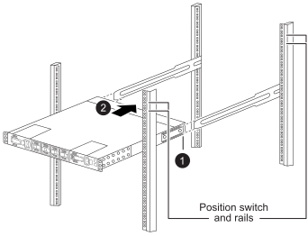

= Install the switches for your AFX 1K storage system
:icons: font
:imagesdir: ../media/

[.lead]
After you complete your preparation for the AFX 1K storage system installation, you should install the switches in the cabinet or telco rack.

Install Cisco Nexus 9332D-GX2B or 9364D-GX2A switches in the cabinet or rack. Install a pass-through panel kit if using the Cisco Nexus 9364D-GX2A switch.

.Before you begin
Make sure you have the following components available: 

* The pass-through panel kit, which is available from NetApp (part number X8784-R6).
+
The NetApp pass-through panel kit contains the following hardware:

 ** One pass-through blanking panel
 ** Four 10-32 x .75 screws
 ** Four 10-32 clip nuts

* For each switch, eight 10-32 or 12-24 screws and clip nuts to mount the brackets and slider rails to the front and rear cabinet posts.
* The Cisco standard rail kit to install the switch in a NetApp cabinet.

NOTE: Jumper cords are not included with the pass-through kit. Contact NetApp to order the right jumper cables if they are not shipped with your switches.

.Steps
. Install the pass-through blanking panel.
//Does this apply only if you are installing in a cabinet?

 .. Determine the vertical location of the switches and blanking panel in the cabinet or rack.
+

 .. Install two clip nuts on each side in the appropriate square holes for front cabinet rails.
 .. Center the panel vertically to prevent intrusion into adjacent rack space, and then tighten the screws.
 .. Insert the female connectors of both jumper cords from the rear of the panel and through the brush assembly.
+
image::../media/cisco_9148_jumper_cords.gif[Female connectors of jumper cord]
+
[cols="1,4"]
|===
a|
image::../media/icon_round_1.png[Callout number 1]
a|
Female connector of the jumper cord.
|===

. Install the rack-mount brackets on the switch chassis.
 .. Position a front rack-mount bracket on one side of the switch chassis so that the mounting ear is aligned with the chassis faceplate (on the PSU or fan side), and then use four M4 screws to attach the bracket to the chassis.
+
image::../media/3132q_front_bracket.gif[front bracket]

 .. Repeat step 2a with the other front rack-mount bracket on the other side of the switch.
 .. Install the rear rack-mount bracket on the switch chassis.
 .. Repeat step 2c with the other rear rack-mount bracket on the other side of the switch.
. Install the clip nuts in the square hole locations for all four IEA posts.
+
image::../media/ru_locations_for_3132q_v.gif[Clip nut locations]
+
Mount the two 9332D-GX2B switches in cabinet locations that provide efficient access to controllers and shelves, such as the middle rows.

. Install the slider rails in the cabinet or rack.
 .. Position the first slider rail at the desired location on the back side of the rear left post, insert screws with the matching thread type, and then tighten the screws with your fingers.
+
image::../media/drw_3132q_v_slider_rails_ieops-2494.svg[Slider rail installation]
+
[cols="1,4"]
|===
a|
image::../media/icon_round_1.png[Callout number 1]
a|
As you gently slide the slider rail, align it to the screw holes in the rack.
a|
image::../media/icon_round_2.png[Callout number 2]
a|
Tighten the screws of the slider rails to the cabinet posts.
|===

 .. Repeat step 4a for the right-side rear post.
 .. Repeat steps 4a and 4b at the desired locations on the cabinet.
. Install the switch in the cabinet or rack.
+
NOTE: This step requires two people: one person to support the switch from the front and another to guide the switch into the rear slider rails.

 .. Position the back of the switch at the desired location on the cabinet.
+

+
[cols="1,4"]
|===
a|
image::../media/icon_round_1.png[Callout number 1]
a|
As the chassis is pushed toward the rear posts, align the two rear rack-mount guides with the slider rails
a|
image::../media/icon_round_2.png[Callout number 2]
a|
Gently slide the switch until the front rack-mount brackets are flush with the front posts.
|===

 .. Attach the switch to the cabinet or rack.
+
image::../media/3132q_attaching.gif[Switch attachment]
+
[cols="1,4"]
|===
a|
image::../media/icon_round_1.png[Callout number 1]
a|
With one person holding the front of the chassis level, the other person should fully tighten the four rear screws to the cabinet posts.
|===

 .. With the chassis now supported without assistance, fully tighten the front screws to the posts.
 .. Repeat steps 5a through 5c for the second switch at the desired location on the cabinet.
+
NOTE: By using the fully installed switch as a support, it is not necessary to hold the front of the second switch during the installation process.

. When the switches are installed, connect the jumper cords to the switch power inlets.
. Connect the male plugs of both jumper cords to the closest available PDU outlets.
+
NOTE: To maintain redundancy, the two cords must be connected to different PDUs.

. Connect the management port on each switch to either of the management switches (if ordered) or connect them directly to your management network.
+
The management network port is the lower RJ-45 port near the right PSU. Route the CAT6 cable for each switch through the pass-through panel after installing the switches to connect to the management switches or network.

.What's next?
After you install the switches in the cabinet or rack, you link:deploy-hardware.html[install the AFX 1K storage system and shelves in the cabinet or rack].
